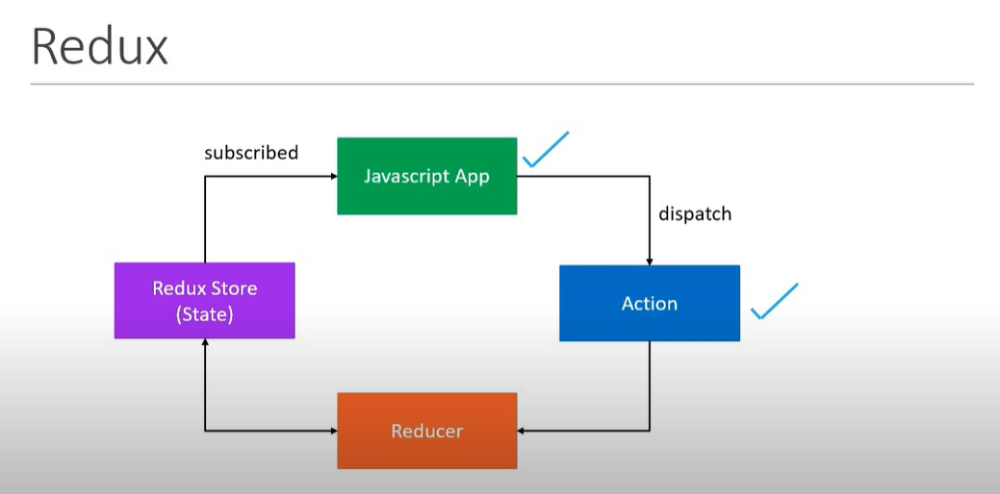

# Actions

- The only way your application can interact with the store
- Carry some information from your app to the redux store
- Plain JavaScript objects
- Have a `type` property that indicates the type of action being performed.
- The `type` property is typically defined as string constants

### Action Creator

- Action creator is function that returns an action.

