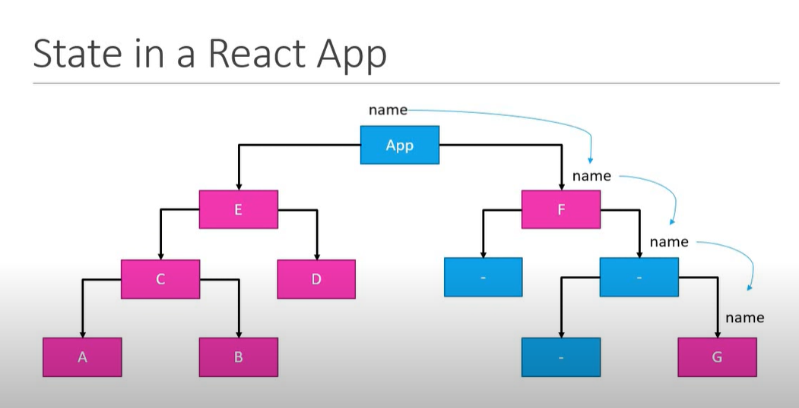

# Redux

Redux is a predictable state container for JavaScript apps.

- It is for JavaScript apps
- It is a state container
- It is predictable

### Redux is for JavaScript applications

- Redux is not tied to React
- Can be used with React, Angular, Vue or even vanilla JavaScript
- Redux is a library for JavaScript applications

### Redux is a state container

- Redux stores the state of your application

Consider a React app - state of a component

```
LoginFormComponent

state = {
    username:'',
    password:'',
    submitting:false
}

UserListComponent

state = {
    users:[]
}
```

State of an app is the state represented by all the individual components of that app

```
Application

state = {
    isUserLoggedIn:true,
    username:'Demo',
    profileUrl:'',
    onlineUsers:[],
    isModalOpened:false
}
```

- Redux will store and manage the application state

### Redux is predictable

Predictable in what way?

- Redux is a state container
- The state of the application can change

Ex: todo list app - item(pending) -> item(completed)

- In redux, all state transitions are explicit and it is possible to keep track of them

- So, the changes to your application's state become predictable.

## Why Redux?

If you want to manage the state of your application in a predictable way, redux can help you.

# React + Redux?

Why would you want to use redux in a react application?

If, the components in react have their own state, why do we need another tool to help manage that state?

Consider a react application -


- The application consists of several components, now let [component A] have an input field which accepts the users name and stores it locally within the component state.


- Now let there is a case that [sibling component B] also needs to display the user name, then how do we send user name from component A to component B ?
- We have to do this using the react way, i.e by lifting the component state.
- The state will now be managed in the [parent component c], which then provides data and methods as props to component A and component B.


- Now what if component D also needs to display the user name.
- The solution again is to lift the state up.
- The state is now managed in the [parent component E].


- Now you find out the [component F] also needs to display the user name.
- Now the only choice you have is to lift the state to the [App Component].

From here we can see that managing state in react is not as simple as it seems, and to make this worse we have new requirement.



- We need to display the user name in [component G].
- The state is maintained in the app component and has to be passed as props through the intermediate components.
- And depending on the level of nesting this can again be a frustrating task.
- Also the components which don't need user name prop still have to be aware of it.

- Now in the component tree, if component A now updates the user name that update goes all the way till App Component, which then starts passing down the updated value as prop to the other components.

- So, in react application we you have considerable number of components, which share some common state, state management could become troublesome. THIS IS WHERE REDUX WILL HELP YOU OUT.

### React + Redux


- With redux your state is contained outside your components.

- If component A wants to change the state. It communicates with the state container.

- The state container updates the state in a predictable manner and then send this value only to those components that are in need of that value.

## Other ways to solve this problem?

React Context - Prevents prop drilling.

If you are familiar with the react hooks,

```
useContext + useReducer
```

can also solve this problem. But redux was first released in 2015, when the hooks solution was not available.

## The REACT-REDUX package

- React - UI Library
- Redux - State Management Library

These two works independently of each other. To directly use redux in your react application is difficult and complex, that is the reason we have react-redux package.


React-Redux offers a couple of function that will help you connect your react application with redux.

## Summary

- React is a library used to build user interfaces.
- Redux is a library for managing state in a predictable way in JavaScript application.
- React-Redux is a library that provides binding to use React and Redux together in an application.
