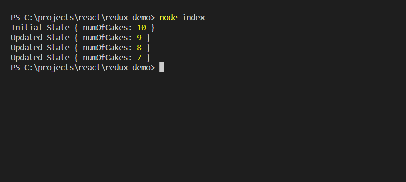

# Store

- One store for the entire application

### Responsibilities -

- Holds application state
- Allows access to state via **getState()**
- Allows state to be updated via **dispatch()**
- Register listener via **subscribe(listener)**
- Handles unregistering of listener via the function returned by subscribe(listener)

### [Source Code](https://github.com/mycodingx/redux-demo/tree/store)
