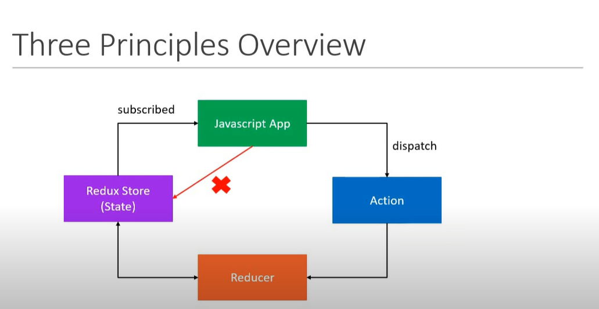

# Three Principles

### First Principle

- The state of your whole application is stored in an object tree within a single store.
- In simple terms, maintain your application state in a single object which would is managed by the redux store.

Ex. - Cake Shop -

Let's assume we are tracking the number of cakes on the shelf

```
{
    numberOfCakes:10
}
```

Now, this object will be managed by the redux store.

## Second Principle

- The only way to change the state is to emit an action, an object describing what happened.
- To update the state of your app, you need to let Redux know about that with an action.
- You are not allowed to directly update the state object.

Ex. Cake Shop -

Let

```
{
type: BUY_CAKE
}
```

## Third Principle

- To specify how the state tree is transformed by actions, you write pure reducers.

Reducer - (previousSate, action) => newState

Ex. Cake Shop -

Reducer is the shopkeeper, when you tell him you wants to buy a cake, he will take one cake from the shelf and reduce the cake count by one, make a receipt and the handover the cake.

```
const reducer = (state, action) =>{
    switch(action.type){
        case BUY_CAKE: return {
            numberOfCakes = state.numberOfCakes - 1
        }
    }
}
```


